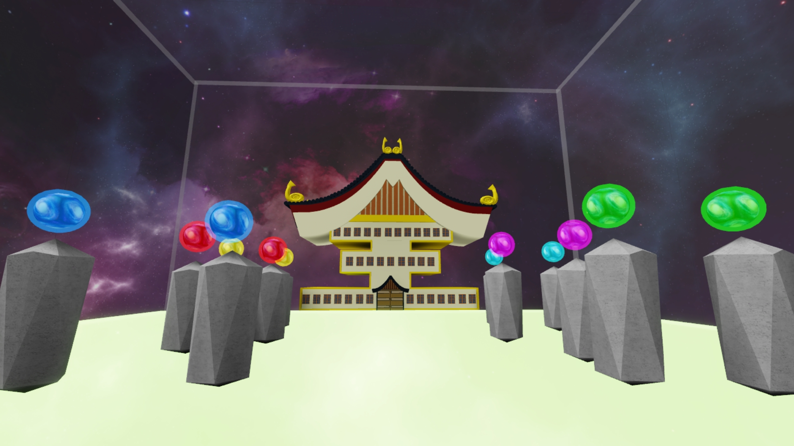
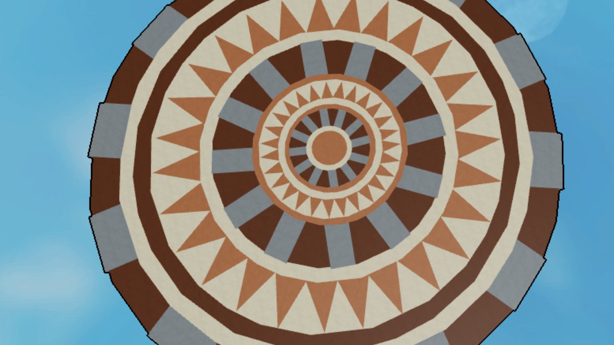
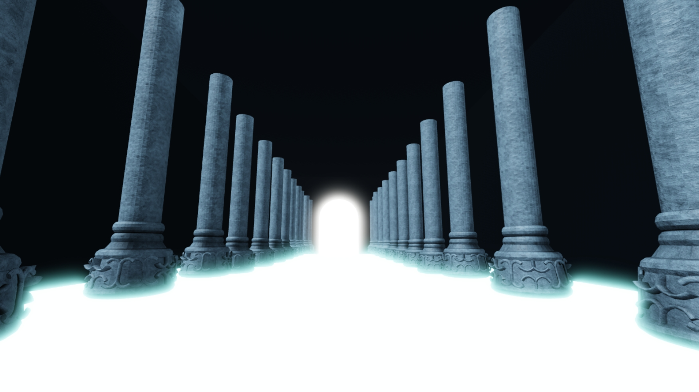
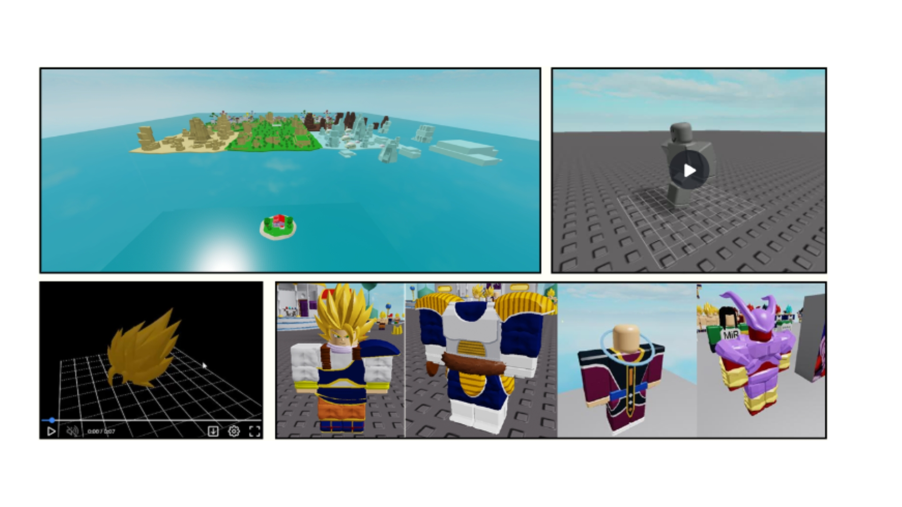

# DBSR: Sci-Fi RPG Battleground System 🐉
**Lead Builder, 3D Modeler & Animator | Roblox Studio & Blender**

DBSR is an immersive RPG environment and asset system inspired by the Dragon Ball multiverse. This project highlights specialized cel-shaded level design, large-scale arena geometry, and custom-modeled character cosmetics.

---

## 🌌 Environment Showcase
The facility features iconic locations designed with a focus on scale and skybox integration.

| Location | Design Focus |
| :--- | :--- |
|  | **Cosmic Architecture:** Implemented symmetrical shrine design with high-saturation neon accents. |
|  | **Complex Geometry:** Precision-aligned circular arena patterns for the Tournament of Power. |
|  | **Lighting & Perspective:** Used aggressive atmospheric fog and floor-glow to create infinite depth. |

---

## ⚔️ Character Assets & 3D Modeling
Beyond environment design, this project features a full suite of custom-modeled assets created in **Blender**.

* **Stylized Hair Modeling:** Sculpted high-poly hair models optimized for Roblox’s engine.
* **Modular Battle Armor:** Designed Saiyan-style chest pieces and multi-part armor sets with accurate vertex weighting.
* **Asset Showcase:**

---

## 🛠️ Technical Details
- **Stylized Shading:** Leveraged custom textures and lighting to achieve a "Cel-Shaded" anime aesthetic.
- **Optimization:** Utilized modular building techniques for the *Stylized World Panorama* to maintain performance across large distances.
- **Precision Building:** The *Tournament of Power* arena was built using mathematical rotation increments to ensure perfect radial symmetry.

## 📂 Repository Structure
* `source/`: Contains the primary `.rbxl` project files for the various maps.
* `documentation/`: High-resolution gallery of map designs and Blender character renders.

---
### 🕹️ Features Included:
- **Zen-Oh's Mansion:** Detailed interior and exterior facade.
- **Tournament of Power Arena:** Full-scale combat map with custom floor geometry.
- **Planet Namek & Earth Biomes:** Stylized terrain with custom trees and rock formations.

---
*Developed by John Ivan Ello*
